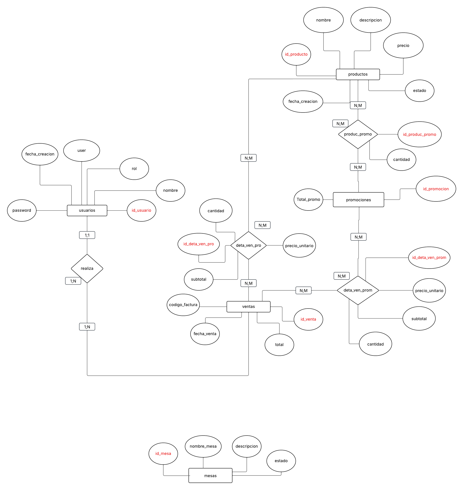

# 🥘 Food Product Management

**Food Product Management** es una aplicación desarrollada para administrar productos y promociones en el rubro alimenticio.  
Está pensada para pequeñas y medianas empresas (PyMEs) que necesiten una solución simple, flexible y funcional para gestionar sus productos, promociones y ventas.
Ofrece herramientas intuitivas para registrar productos, crear promociones personalizadas y registrar ventas de productos individuales, promociones o combinaciones de ambos.

## ✨ Características

- Ver, listar, agregar, editar y eliminar **productos**
- Ver, listar, agregar, editar y eliminar **mesas**
- Ver, listar, agregar, editar y eliminar **promociones**
- Ver, listar, agregar, editar y eliminar **usuarios**
- Registrar ventas:
  - ✅ Venta mixta (productos + promociones)  
  - ✅ Venta solo de productos  
  - ✅ Venta solo de promociones

## 🛠️ Tecnologías utilizadas

- **Java 17**  
- **SQLite**: base de datos embebida , liviana y facil de instalar 
- **Spring Boot**  
- **Lombok**

## 🧠 Arquitectura y patrones de diseño

- **Arquitectura MVC** (Modelo-Vista-Controlador)
- **Patrón Singleton**:
- **Patrón Repository**: encapsula el acceso a datos mediante interfaces e implementaciones

## 🗃️ Diagrama Entidad-Relación

A continuación se muestra el diseño de la base de datos utilizado por el sistema:
  
  
## 📦 Colección Postman

[📥 Descargar colección](./docs/RestaSP.postman_collection.json)

 

